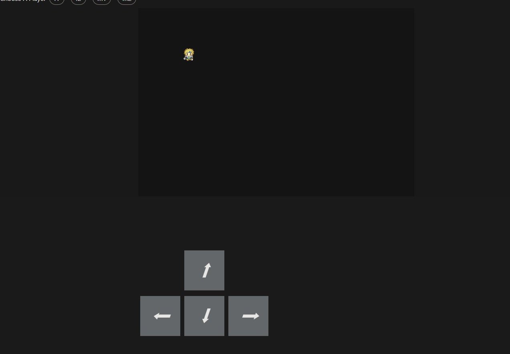

### RPG Game

Learning custom hook react and using them in making a charactor move.

### How to move

You can use keybord arrow keys to move the player.

  

### Custom hooks

Custom hook is made to get the key press by the name usekeypress.
and also to walk by the name useWalk.

